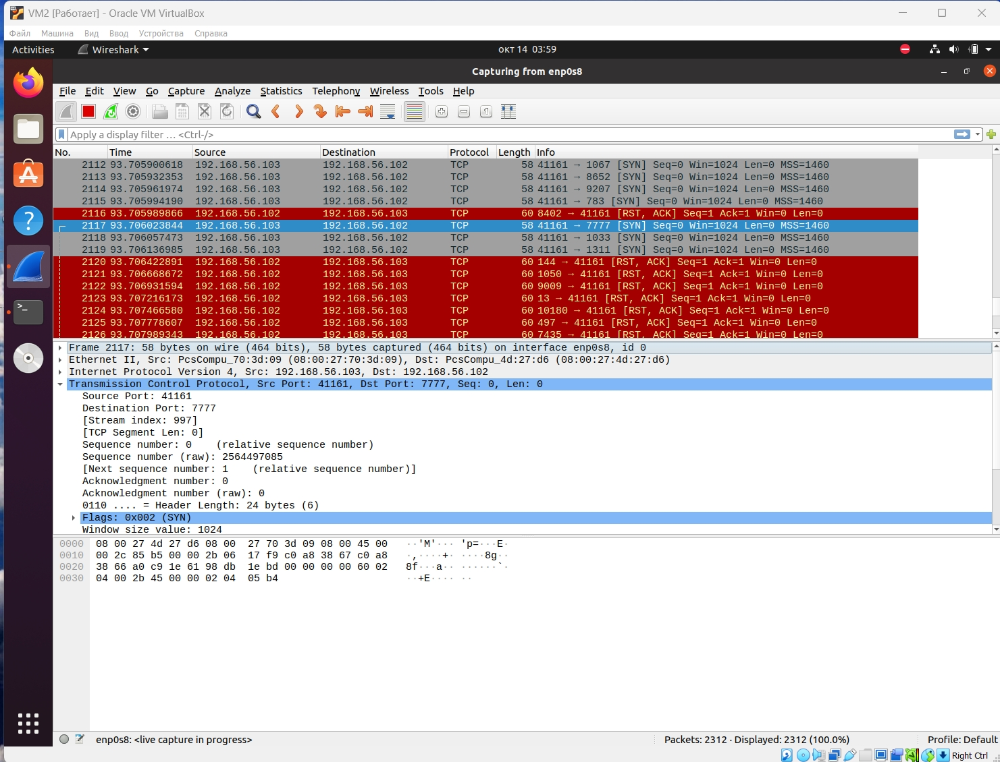

## Домашнее задание к занятию «Уязвимости и атаки на информационные системы» (Щербатых А.Е.)
### Задание 1
Скачайте и установите виртуальную машину Metasploitable: https://sourceforge.net/projects/metasploitable/.

Это типовая ОС для экспериментов в области информационной безопасности, с которой следует начать при анализе уязвимостей.

Просканируйте эту виртуальную машину, используя **nmap**.

Попробуйте найти уязвимости, которым подвержена эта виртуальная машина.

Сами уязвимости можно поискать на [сайте](https://www.exploit-db.com/.)

Для этого нужно в поиске ввести название сетевой службы, обнаруженной на атакуемой машине, и выбрать подходящие по версии уязвимости.

Ответьте на следующие вопросы:

Какие сетевые службы в ней разрешены?

Какие уязвимости были вами обнаружены? (список со ссылками: достаточно трёх уязвимостей)

*Приведите ответ в свободной форме.*

### Решение
- Какие сетевые службы в ней разрешены?
  

  
- Какие уязвимости были вами обнаружены? (список со ссылками: достаточно трёх уязвимостей)

  Vsftpd 2.3.4 Backdoor [Backdoor Command Execution (Metasploit)](https://www.exploit-db.com/exploits/17491)

PostgreSQL 8.3.6: [Conversion Encoding Remote Denial of Service](https://www.exploit-db.com/exploits/32849)

  PostgreSQL 8.3.6: [Low Cost Function Information Disclosure](https://www.exploit-db.com/exploits/32847)

  *скрины уже не стал делать*
  
### Задание 2

Проведите сканирование Metasploitable в режимах SYN, FIN, Xmas, UDP.

Запишите сеансы сканирования в Wireshark.

Ответьте на следующие вопросы:

- Чем отличаются эти режимы сканирования с точки зрения сетевого трафика?

- Как отвечает сервер?

*Приведите ответ в свободной форме.*

### Решение

*Заменим сетевой адаптер на ВМ и установим Wireshark на одну из ВМ, т.к. инстанс на самом ноутбуке не хочет "видеть" обмен трафиком на ВМ (два часа ночью убил на эксперименты)*

Новые IP-адреса ВМ на скрине

**Режим SYN.**

Отправляется пакет с флагом SYN для установки соединения. Ответ SYN/ACK - порт открыт (После происходит сброс соединения RST). Ответ RST/ACK - порт закрыт.

**Режим FIN.**

Отправляется пакет с флагом FIN. Ответ RST/ACK - порт закрыт. Если ответа нет - порт открыт|фильтруется.

**Режим Xmas.**

Отправляется пакет с флагами FIN/PSH/URG. Ответ RST/ACK - порт закрыт. Если ответа нет - порт открыт|фильтруется.

**Режим UDP.**

Отправляет пустой UDP заголовок на каждый порт. Ответ ICMP ошибка о недостижимости порта (тип 3, код 3) - порт закрыт. Другие ICMP ошибки недостижимости - порт фильтруется. После нескольких попыток без ответа - порт открыт|фильтруется. Ответ UDP - порт открыт.

