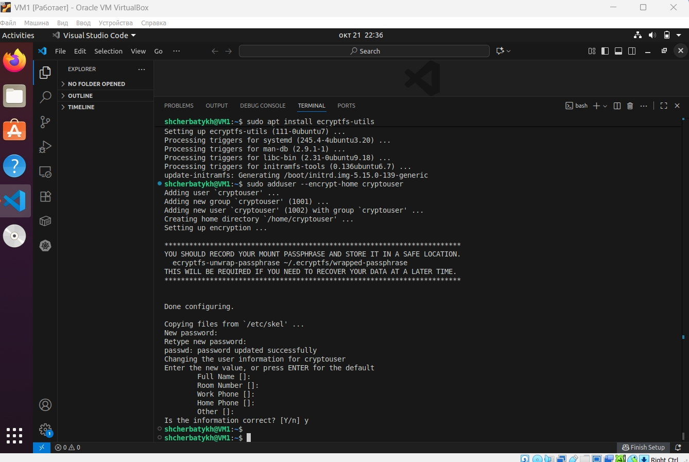
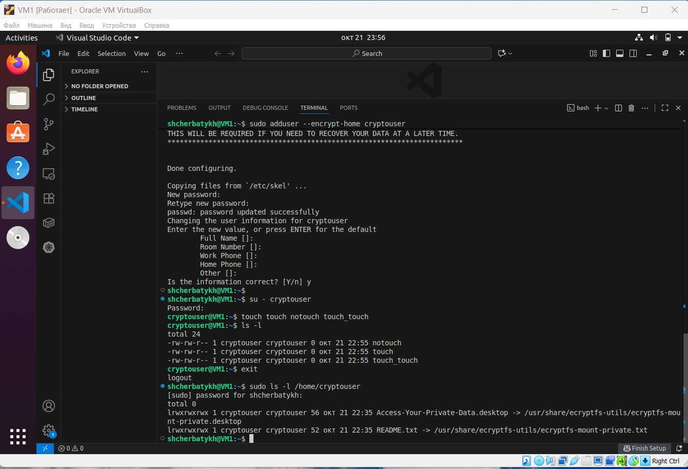
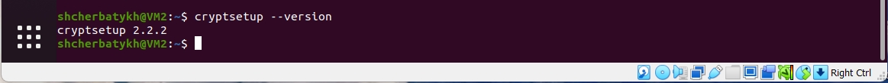
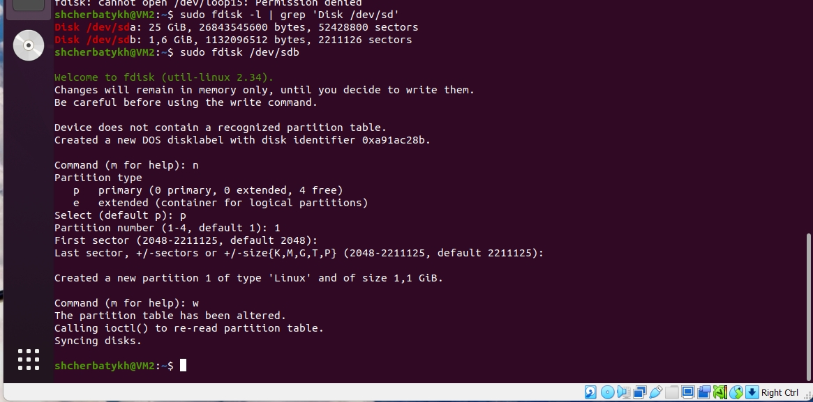
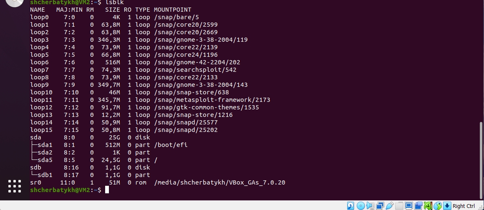
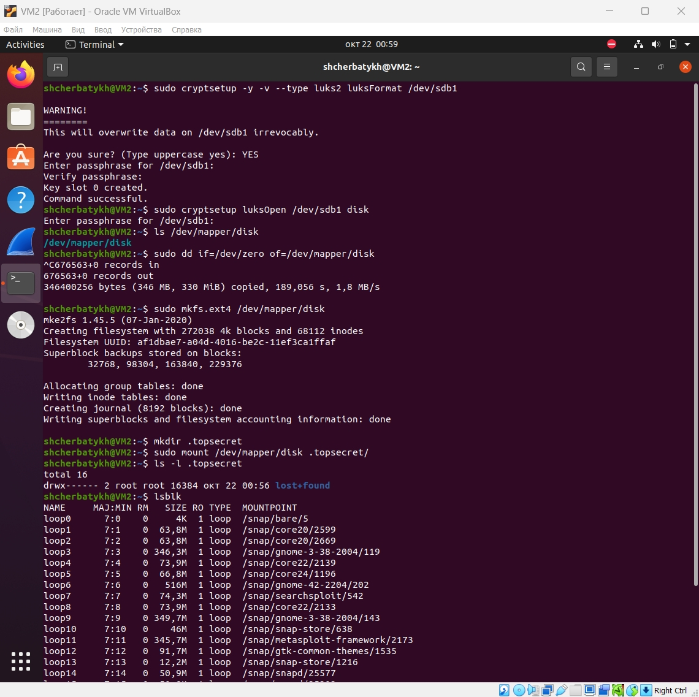
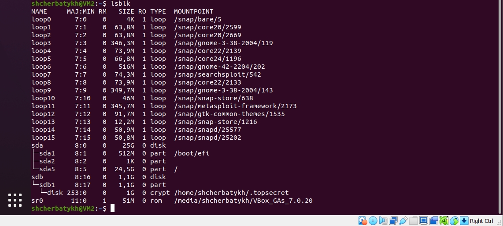
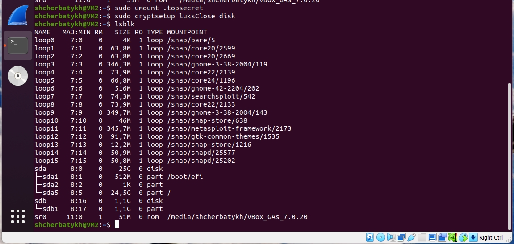

## Домашнее задание к занятию «Защита хоста» (Щербатых А.Е.)
### Задание 1
Установите eCryptfs.

Добавьте пользователя cryptouser.

Зашифруйте домашний каталог пользователя с помощью eCryptfs.

В качестве ответа пришлите снимки экрана домашнего каталога пользователя с исходными и зашифрованными данными.

### Ответ:
Установите eCryptfs.

Добавьте пользователя cryptouser. Зашифруйте домашний каталог пользователя с помощью eCryptfs.

### Задание 2
Установите поддержку LUKS.

Создайте небольшой раздел, например, 100 Мб.

Зашифруйте созданный раздел с помощью LUKS.

В качестве ответа пришлите снимки экрана с поэтапным выполнением задания.

### Ответ:
*Продолжил выполнение на другой ВМ, т.к. на первой полетел загрузочный раздел (решил создать доп.раздел на /dev/sda...)*

Установите поддержку LUKS.

Создайте небольшой раздел, например, 100 Мб.

*Создал раздел на весь доп.диск (примерно 1 Гб)*

Зашифруйте созданный раздел с помощью LUKS.

