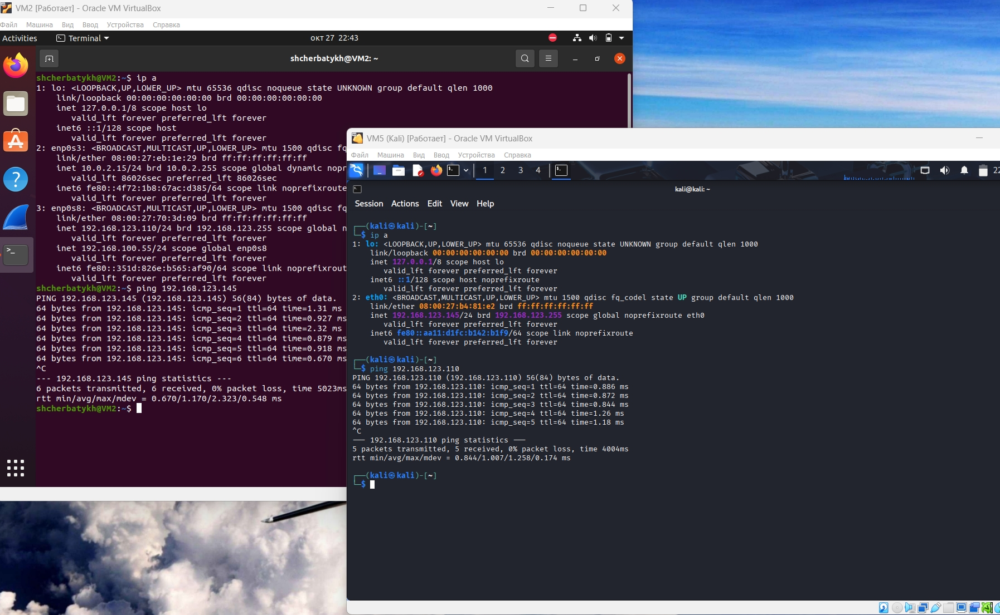

## Домашнее задание к занятию «Защита хоста» (Щербатых А.Е.)
### Задание 1
Проведите разведку системы и определите, какие сетевые службы запущены на защищаемой системе:

**sudo nmap -sA < ip-адрес >**

**sudo nmap -sT < ip-адрес >**

**sudo nmap -sS < ip-адрес >**

**sudo nmap -sV < ip-адрес >**

По желанию можете поэкспериментировать с [Опциями](:https://nmap.org/man/ru/man-briefoptions.html.)

*В качестве ответа пришлите события, которые попали в логи Suricata и Fail2Ban, прокомментируйте результат.*

### Ответ:
Установите eCryptfs.

Добавьте пользователя cryptouser. Зашифруйте домашний каталог пользователя с помощью eCryptfs.

