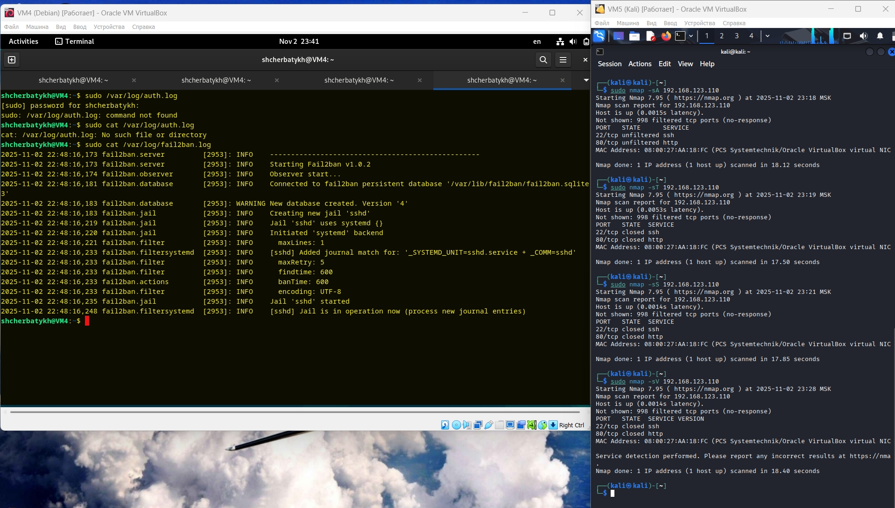
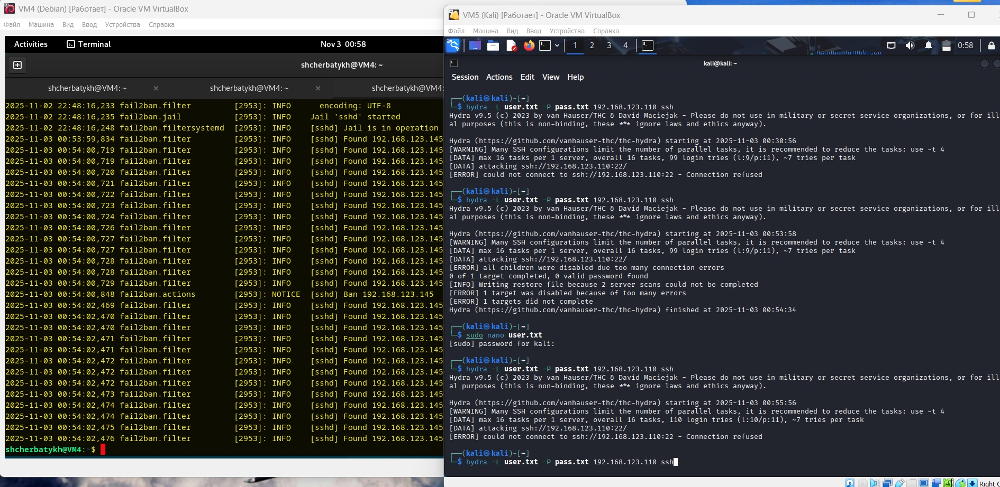
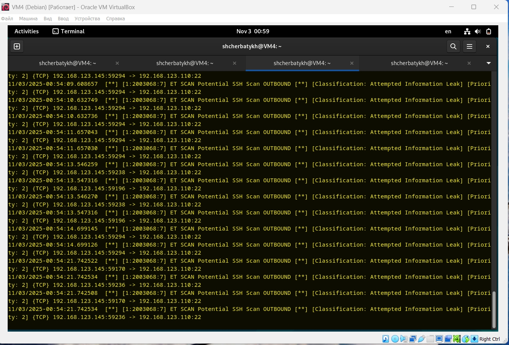
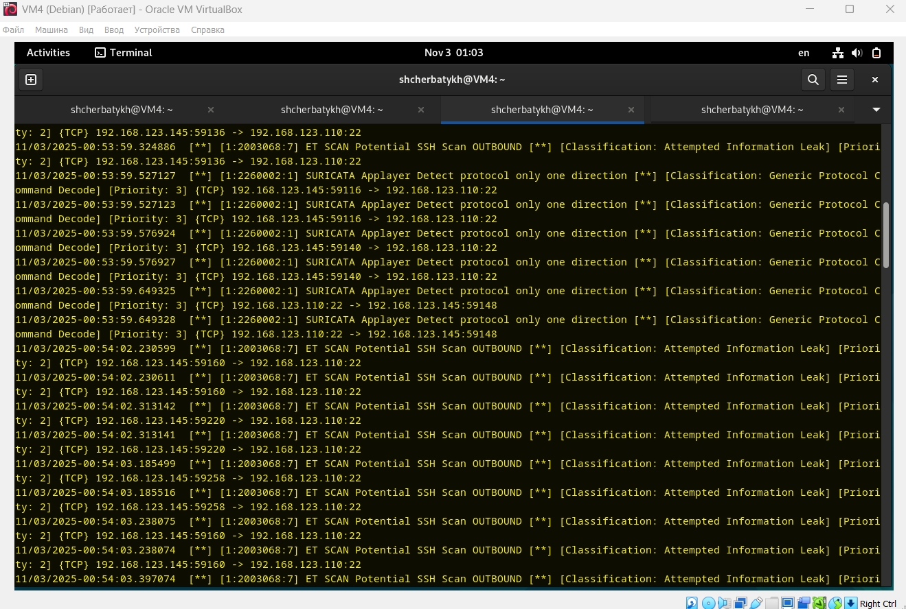
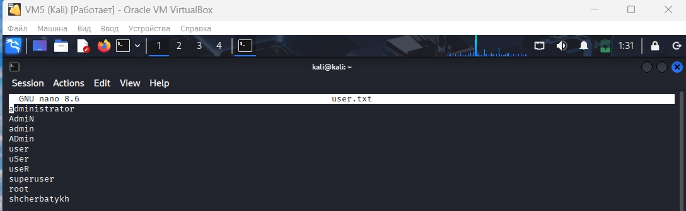
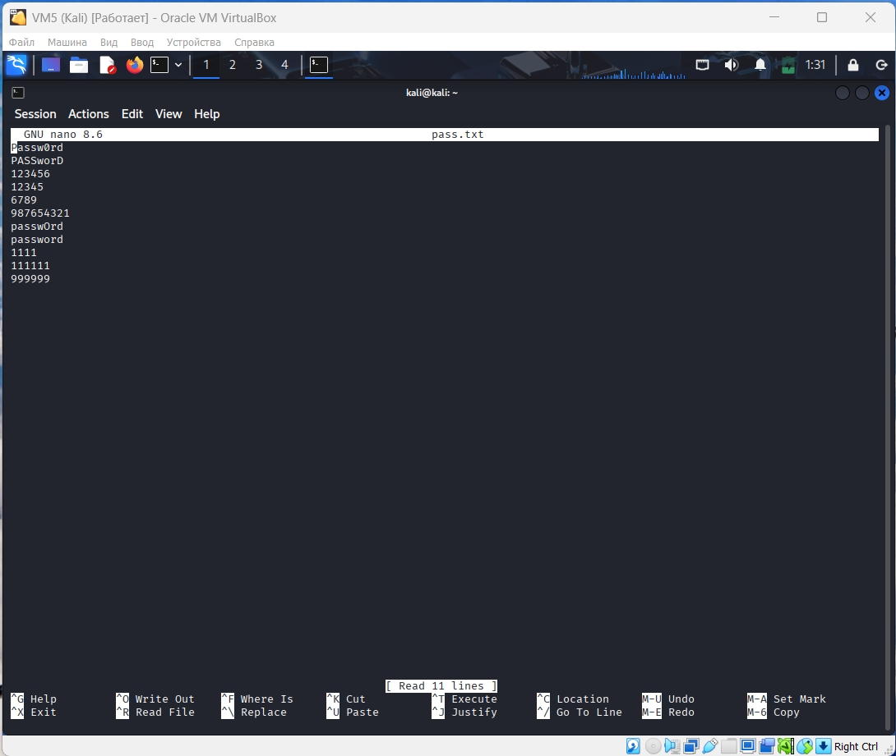
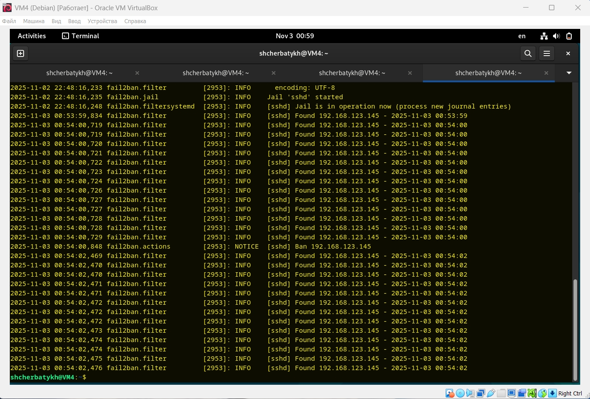

## Домашнее задание к занятию «Защита сети» (Щербатых А.Е.)
### Задание 1
Проведите разведку системы и определите, какие сетевые службы запущены на защищаемой системе:

**sudo nmap -sA < ip-адрес >**

**sudo nmap -sT < ip-адрес >**

**sudo nmap -sS < ip-адрес >**

**sudo nmap -sV < ip-адрес >**

По желанию можете поэкспериментировать с [Опциями](https://nmap.org/man/ru/man-briefoptions.html.)

*В качестве ответа пришлите события, которые попали в логи Suricata и Fail2Ban, прокомментируйте результат.*

### Ответ:
Установим сетевую связность между двумя ВМ

**sudo nmap -sA 192.168.123.110**

Suricata не реагирует на это сканирование.

**sudo nmap -sT 192.168.123.110**

Suricata определяет подозрительный входящий трафик на порты: 3306 MySQL, 1433 MSSQL, 5432 PostgreSQL, 1521 Oracle SQL, и классифицирует его как "Потенциально опасный трафик" со средним приоритетом. И потенциальное сканирование VNC 5900-5920 с классификацией "Попытка утечки информации" со средним приоритетом.

**sudo nmap -sS 192.168.123.110**

Suricata определяет то же, что и при сканировании nmap -sT. Различия только в портах атакующего хоста и порте атакуемого хоста при потенциальном сканировании VNC 5900-5920.

**sudo nmap -sV 192.168.123.110**

Ситуация аналогична той, что была при сканировании в режимах nmap -sT и nmap -sS. Исключение составляет, что не было трафика на порты: 3306 MySQL, 5432 PostgreSQL. При потенциальном сканировании VNC 5900-5920 была попытка сканирования через порт, отличный от предыдущих.

**Fail2Ban**
Fail2Ban никак не отреагировал. 

### Задание 2
Проведите атаку на подбор пароля для службы SSH:

**hydra -L users.txt -P pass.txt < ip-адрес > ssh**

Настройка hydra:
создайте два файла: users.txt и pass.txt;
в каждой строчке первого файла должны быть имена пользователей, второго — пароли. В нашем случае это могут быть случайные строки, но ради эксперимента можете добавить имя и пароль существующего пользователя.
Дополнительная информация по [hydra](https://kali.tools/?p=1847)

Включение защиты SSH для Fail2Ban:
открыть файл /etc/fail2ban/jail.conf,
найти секцию ssh,
установить enabled в true.
Дополнительная информация по [Fail2Ban](https://putty.org.ru/articles/fail2ban-ssh.html.)

*В качестве ответа пришлите события, которые попали в логи Suricata и Fail2Ban, прокомментируйте результат.*

### Ответ:

Проводим атаку на подбор пароля для службы SSH:
**hydra -L user.txt -P pass.txt 192.168.123.110 ssh**

Пароль не был подобран, так как атакующая машина попала в бан.

**События Suricata**
Сканирование идет с разных портов атакующего хоста на 22 порт атакуемого хоста. Suricata определяет: "Потенциальное SSH-сканирование", "Потенциальное SSH-сканирование ИСХОДЯЩЕЕ" и классифицирует его как "Попытку утечки информации" со средним приоритетом; "Обнаружен протокол только в одном направлении", "Поток с избыточными повторными передачами", классифицирует его как "Декодирование команд общего протокола" с низким приоритетом.

Содержимое файлов user.txt и pass.txt, созданных на атакующей машине (ОС Kali Linux)

**События Fail2Ban**
Fail2Ban реагирует на атаку и множественный подбор пользователя и пароля, и помещает атакующий хост в бан.

