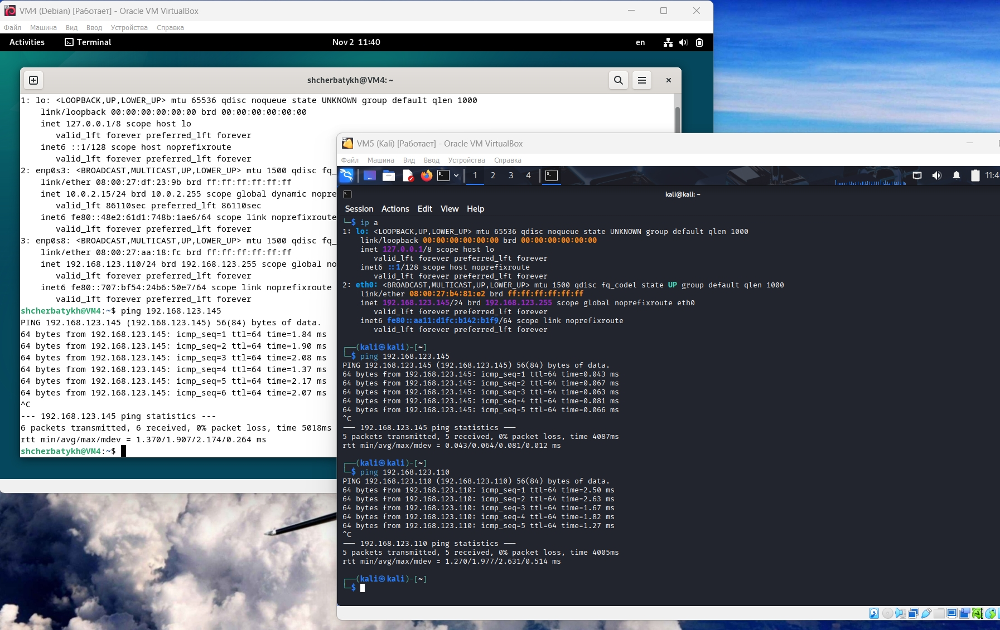
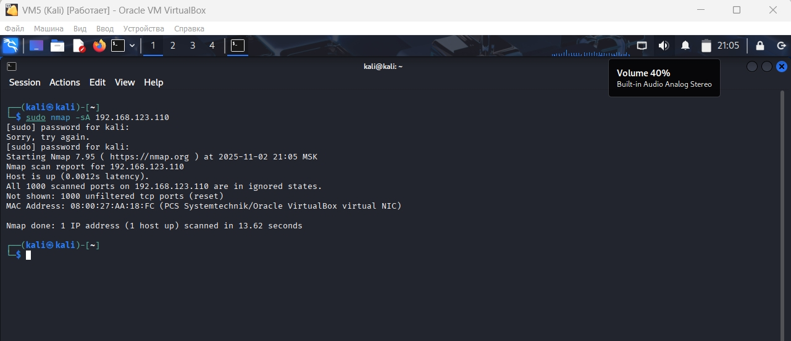
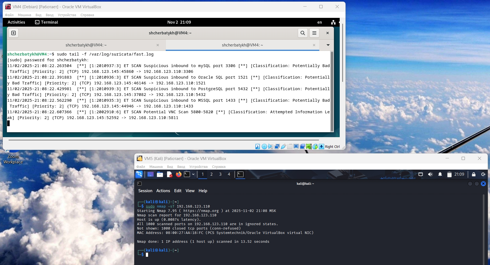
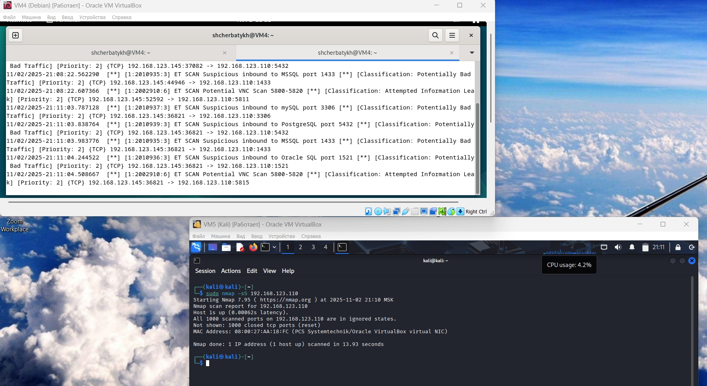
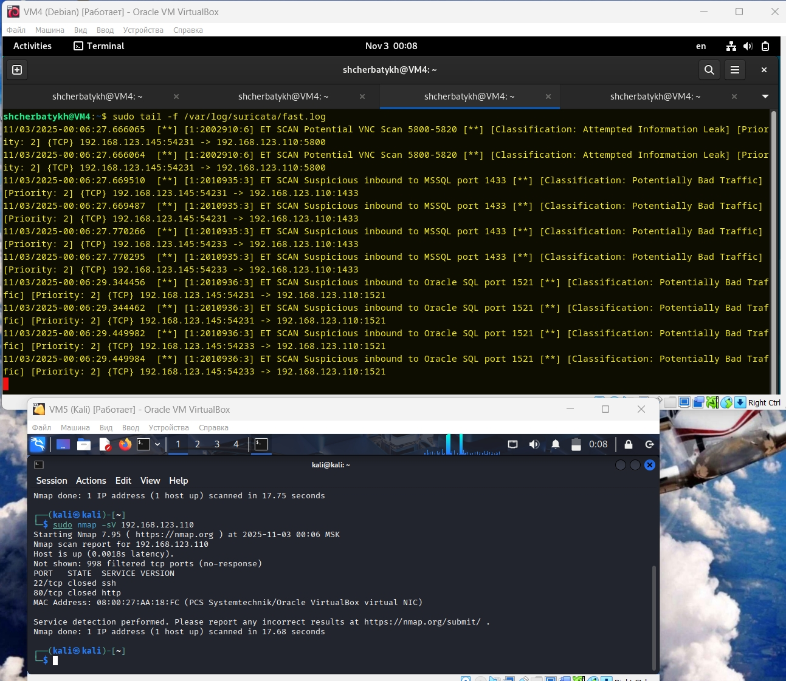

## Домашнее задание к занятию «Защита сети» (Щербатых А.Е.)
### Задание 1
Проведите разведку системы и определите, какие сетевые службы запущены на защищаемой системе:

**sudo nmap -sA < ip-адрес >**

**sudo nmap -sT < ip-адрес >**

**sudo nmap -sS < ip-адрес >**

**sudo nmap -sV < ip-адрес >**

По желанию можете поэкспериментировать с [Опциями](https://nmap.org/man/ru/man-briefoptions.html.)

*В качестве ответа пришлите события, которые попали в логи Suricata и Fail2Ban, прокомментируйте результат.*

### Ответ:
Установим сетевую связность между двумя ВМ

**sudo nmap -sA 192.168.123.110**

Suricata не реагирует на это сканирование.

**sudo nmap -sT 192.168.123.110**

Suricata определяет подозрительный входящий трафик на порты: 3306 MySQL, 1433 MSSQL, 5432 PostgreSQL, 1521 Oracle SQL, и классифицирует его как "Потенциально опасный трафик" со средним приоритетом. И потенциальное сканирование VNC 5900-5920 с классификацией "Попытка утечки информации" со средним приоритетом.

**sudo nmap -sS 192.168.123.110**

Suricata определяет то же, что и при сканировании nmap -sT. Различия только в портах атакующего хоста и порте атакуемого хоста при потенциальном сканировании VNC 5900-5920.

**sudo nmap -sV 192.168.123.110**

Ситуация аналогична той, что была при сканировании в режимах nmap -sT и nmap -sS. Исключение составляет, что не было трафика на порты: 3306 MySQL, 5432 PostgreSQL. При потенциальном сканировании VNC 5900-5920 была попытка сканирования через порт, отличный от предыдущих.

